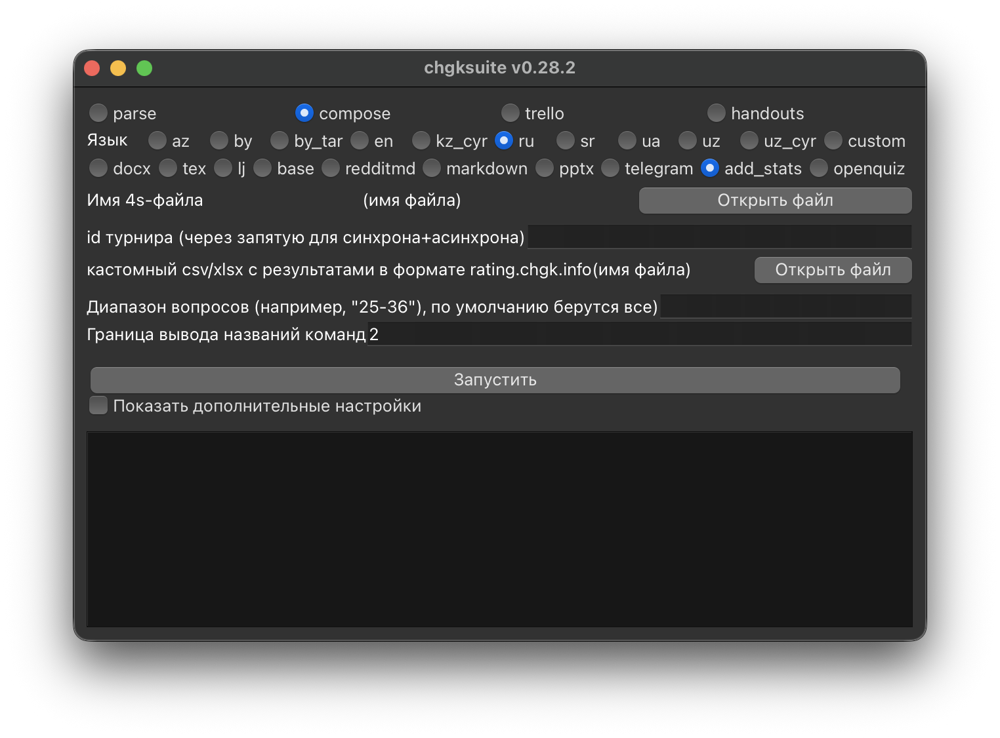

# Статистика взятий

Если расплюсовка вашего турнира уже опубликована на сайте рейтинга, то укажите `id` турнира и нажмите «Запустить». Будет создана копия указанного вами 4s файла, где статистика взятий добавлена в комментарии. В поле `id` также можно указать несколько турниров (через запятую без пробелов).

Если ваш турнир ещё не завершился, и расплюсовка не видна публично, зайдите на страницу турнира на сайте рейтинга и экспортируйте xlsx файл с помощью функции `Скачать заготовку вопросной таблицы без разбиения на туры`. Оставьте поле `id` турнира пустым, но укажите путь до скачанного xlsx файла. Чтобы статистика успешно добавилась, в турнире не должно оставаться спорных ответов.

Если вашего турнира вообще нет на турнирном сайте, вы можете сами подготовить кастомный xlsx или csv файл в формате `вопросная таблица без разбиения на туры` и указать путь до него.

Иногда вы хотите выложить, скажем, только один тур из трёх. Тогда вам нужно указать диапазон вопросов, например `25-36`. Это значит, что к вопросу 1 в пакете подклеится статистика из вопроса 25 с турнирного сайта или из файла, к вопросу 2 — из вопроса 26, и так далее.
