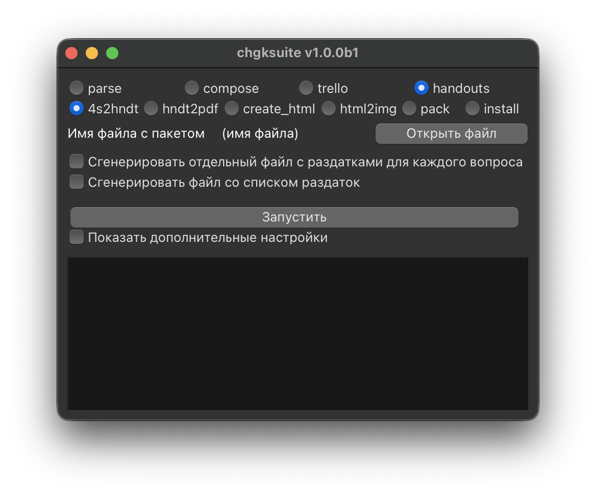
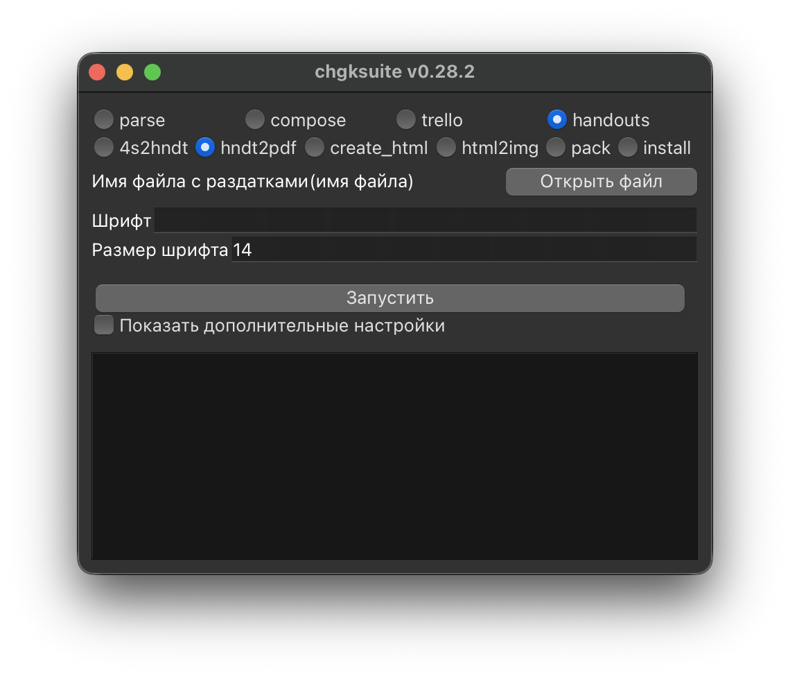

# Раздатки

chgksuite позволяет генерировать PDF-файлы с раздатками для печати. Процесс состоит из двух шагов: сначала из 4s-файла извлекаются раздатки в формат .hndt (либо файл в этом формате можно написать руками), а затем из hndt-файла они верстаются в PDF.

## Шаг 1: Извлечение раздаток из пакета



Выберите **4s-файл** с пакетом и нажмите «Запустить». В той же папке появится текстовый файл с раздатками. Каждая раздатка, оформленная в 4s-файле в квадратных скобках (`[Раздаточный материал: ...]`), будет извлечена автоматически.

Полезные галочки:

- **Сгенерировать отдельный файл с раздатками для каждого вопроса** — вместо одного файла со всеми раздатками создаст по одному файлу на каждый вопрос с раздаткой.
- **Сгенерировать файл со списком раздаток** — создаст текстовый файл со списком вопросов, у которых есть раздатки, с разбивкой по турам.

## Шаг 2: Вёрстка раздаток в PDF



Откройте файл с раздатками, полученный на предыдущем шаге, укажите шрифт и размер шрифта (если нужно), затем нажмите «Запустить». Появится PDF-файл с раздатками, готовый к печати.

При первом запуске chgksuite автоматически скачает и установит движок Tectonic (компилятор LaTeX), это может занять некоторое время.

На странице A4 раздатки размещаются в сетке: каждая ячейка — одна копия раздатки. Линии разреза между командами рисуются сплошными, а внутри одной команды — пунктирными.

## Формат файла раздаток

Файл раздаток состоит из блоков, разделённых строкой `---`. Каждый блок начинается с ключевых слов, за которыми следует содержимое раздатки. Пример:

```
for_question: 1
columns: 3

Текст раздатки
для первого вопроса
---
for_question: 5
columns: 2
image: razdatka_5.jpg
resize_image: 0.8
```

### Ключевые слова

| Ключевое слово | Тип | По умолчанию | Описание |
|---------------|-----|-------------|----------|
| `for_question` | число | — | Номер вопроса |
| `columns` | число | — | Количество столбцов в сетке |
| `rows` | число | 1 | Количество строк в сетке |
| `image` | строка | — | Путь к файлу с картинкой |
| `resize_image` | число | 1.0 | Масштаб картинки (от 0 до 1) |
| `font_size` | число | 14 | Размер шрифта в пунктах |
| `font_family` | строка | Arial | Шрифт |
| `handouts_per_team` | число | 3 | Количество копий на команду |
| `grouping` | строка | horizontal | Направление группировки команд: `horizontal` или `vertical` |
| `no_center` | — | — | Не центрировать текст |
| `raw_tex` | — | — | Не экранировать LaTeX-символы |
| `color` | число | 0 | 1 = цветная раздатка, 0 = ч/б |
| `rotate` | строка | — | Поворот картинки: `r` (по часовой) или `l` (против часовой) |
| `tikz_mm` | число | 2 | Внутренний отступ ячейки в мм |
| `hspace` | число | 1.5 | Горизонтальный отступ между ячейками в мм |
| `vspace` | число | 1.0 | Вертикальный отступ между ячейками в мм |

## Дополнительные настройки hndt2pdf

В дополнительных настройках можно изменить:

- **Размер бумаги** — ширина и высота в мм (по умолчанию A4: 210 x 297).
- **Отступы всей страницы** — верхний, нижний, левый, правый в мм (по умолчанию 5).
- **Внутренний отступ ячейки в миллиметрах** (`--tikz_mm`).
- **Ширина ячейки** (`--boxwidth`, `--boxwidthinner`) — ширина блока и внутренняя ширина в мм (по умолчанию рассчитываются автоматически).
- **Суффикс с количеством команд** (`--add_n_teams on`) — добавляет к имени файла количество команд.
- **Сжатие PDF** — по умолчанию включено (`--compress_pdf on`). Для сжатия используется `PyMuPDF`. Чтобы отключить: `--compress_pdf off`.

## Упаковка раздаток для нескольких команд

Подкоманда **pack** позволяет объединить несколько раздаток в один PDF-файл, оптимизированный для печати на заданное количество команд. Укажите папку с файлами раздаток, количество команд, и chgksuite создаст два файла: `packed_handouts_color.pdf` и `packed_handouts_bw.pdf`.

## Раздатки из HTML

Если раздатка слишком сложна для текстового формата (например, содержит таблицы или специальное форматирование), можно создать её в HTML:

1. **create_html** — создаёт шаблон HTML-файла нужной ширины (доля от ширины A4, соответствующая hndt-колонке: `1/6`, `1/3`, `1/2` или `1`). Отредактируйте его в текстовом редакторе.
2. **html2img** — конвертирует HTML-файл в PDF и PNG с помощью Playwright (при первом запуске скачает headless Chromium).

## Установка Tectonic

Подкоманда **install** устанавливает движок Tectonic. Обычно это делается автоматически при первом запуске **hndt2pdf**, но при необходимости можно запустить установку вручную.
