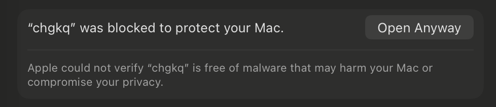
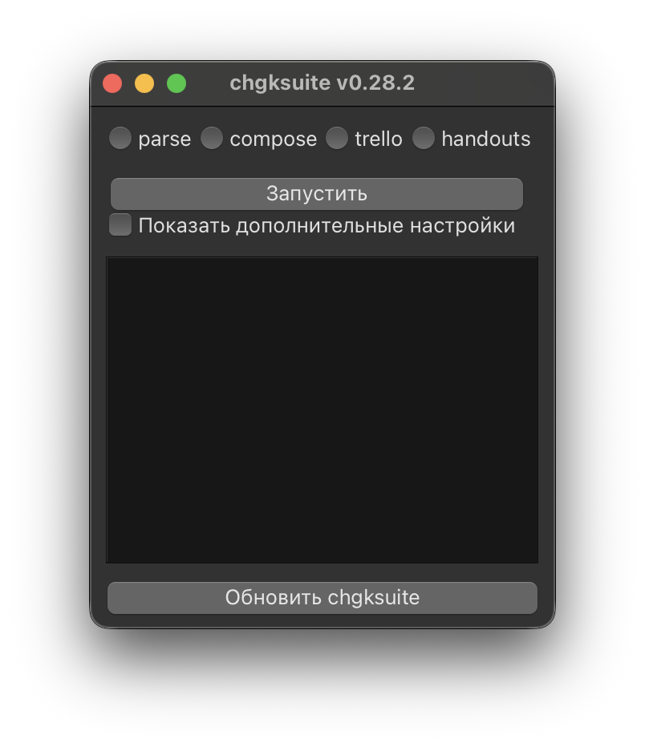

# Интро и установка

**chgksuite** — это система для работы с пакетами основной дисциплины ([КВРМ](https://rating.chgk.gg/rules/), «60 секунд», ЧГК). Она позволяет единообразно оформить вопросы, а также экспортировать их в разные форматы, в том числе с использованием спойлеров для ответов и комментариев.

## Установка

### Стэндалон-билд, версия Qt
- [Windows x64](https://github.com/peczony/chgksuite/releases/download/v0.28.2/chgkq-windows-x64.exe)
- [macOS с процессором Intel](https://github.com/peczony/chgksuite/releases/download/v0.28.2/chgkq-macos-x64.zip)
- [macOS с процессором Apple (M1 и новее)](https://github.com/peczony/chgksuite/releases/download/v0.28.2/chgkq-macos-arm64.zip)
- [Linux AMD64](https://github.com/peczony/chgksuite/releases/download/v0.28.2/chgkq-linux-x64)

### Стэндалон-билд, версия Tk (попробуйте, если Qt не работает)
- [Windows x64](https://github.com/peczony/chgksuite/releases/download/v0.28.2/chgkt-windows-x64.exe)
- [macOS с процессором Intel](https://github.com/peczony/chgksuite/releases/download/v0.28.2/chgkt-macos-x64.zip)
- [macOS с процессором Apple (M1 и новее)](https://github.com/peczony/chgksuite/releases/download/v0.28.2/chgkt-macos-arm64.zip)
- [Linux AMD64](https://github.com/peczony/chgksuite/releases/download/v0.28.2/chgkt-linux-x64)
- [Linux ARM64](https://github.com/peczony/chgksuite/releases/download/v0.28.2/chgkt-linux-arm64)

### Консольный режим, установка через uv

Поставьте uv для вашей системы: <https://docs.astral.sh/uv/#installation>

Затем запустите команды:

```
uv venv --python 3.12.0 py
source py/bin/activate
uv pip install chgksuite chgksuite-qt
```

После этого запуск команды `chgkq` должен вызывать графический интерфейс `chgksuite`.

### Консольный режим, установка через miniconda

Если у вас нет Python, проще всего установить его с использованием [miniconda](https://docs.conda.io/en/latest/miniconda.html). Скачайте версию для вашей системы и установите (на MacOS проще использовать `pkg`, чем `bash`).

Далее, на MacOS и Linux начните новую сессию в терминале, а на Windows запустите Anaconda Prompt.

## Запуск стэндалон-билда

Просто запустите скачанный файл. На macOS после первой попытки запуска вам понадобится зайти в `System Settings → Privacy & Security` и нажать кнопку `Open Anyway`, чтобы разрешить запуск. Первый запуск может занимать пару минут, поскольку программа будет скачивать и настраивать всё необходимое. Дальше должно запускаться быстро.



## Запуск в терминале

Введите в терминале команду `chgkq` — запустится главное окно программы.

Если вы установили старый интерфейс `chgksuite-tk`, то команда называется не `chgkq`, а `chgkt`.



Дальнейшие действия описаны в следующих главах.

Команда `chgksuite` запускает чисто консольный интерфейс.

## Поддержка

С общими вопросами, ответы на которые могут быть полезны другим, пишите в [телеграм-чат chgksuite](https://t.me/chgksuite).

Если проблема с конкретным файлом, пишите [в телеграм](https://t.me/pecheny) или [на почту](mailto:ap@pecheny.me).
