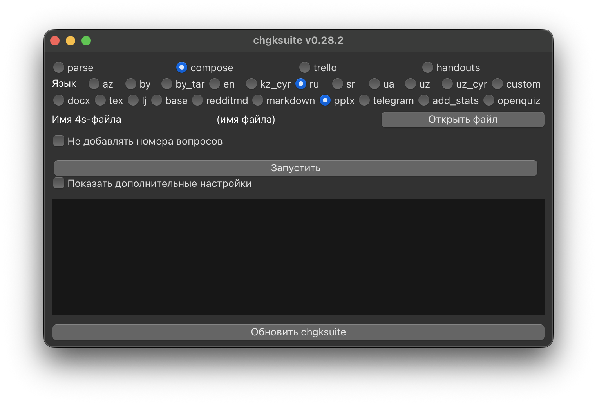
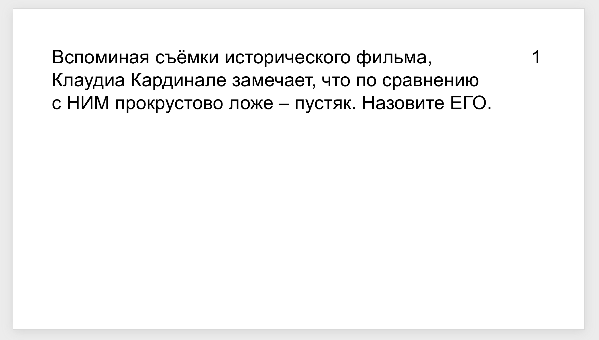
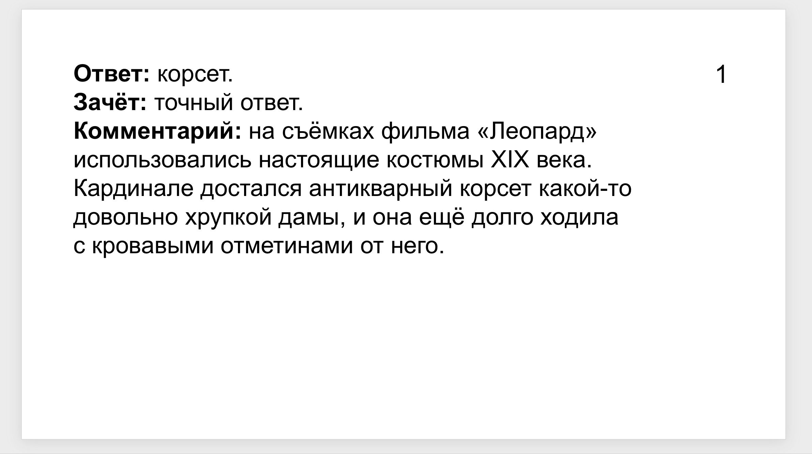
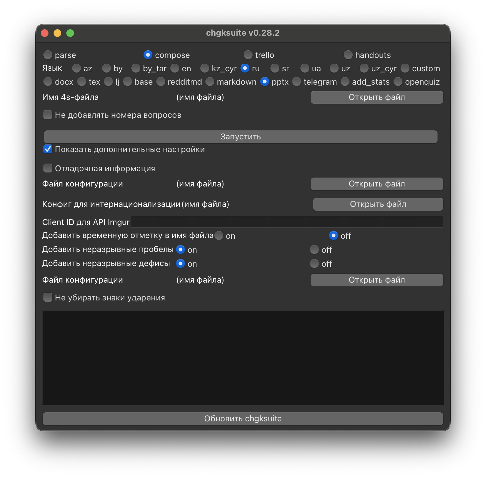

# PowerPoint



Для онлайн-игр может быть полезно создание презентаций. Откройте **4s-файл**, который у вас получился после [парсинга](../4s). После запуска появится презентация в pptx. В презентации автоматически удалены ударения и информация в квадратных скобках для ведущего, а также внесены изменения [из тега screen](../4s#screen).

После создания откройте файл — возможно, понадобится что-нибудь руками поправить.

По умолчанию слайды с вопросом и ответом выглядят так:




Если вы хотите использовать свой шаблон презентации, посмотрите в следующий пункт.

## Дополнительные настройки



Нажмите галочку «Показать дополнительные настройки» и пропишите путь к собственному файлу конфигурации.

Стандартный файл выглядит так:

```
template_path = "template.pptx"
add_plug = true
add_comment = true
add_zachet = true

[textbox]
left = 0.8
top = 0.8
width = 10.5
height = 6.1

[number_textbox]
left = 12
top = 0.8
width = 1
height = 1

[list]
numbering_style = "1."
blank_line_before_items = true

[handout]
include_label = false
font_size = 32
align = "left"
space_after = 18
image_scale = 1.3

[font]
name = "Arial"
default_size = 32
title_size = 60
```

В нём вас главным образом интересует поле `template_path` — это путь к презентации, которая используется в качестве шаблона. Если вы хотите использовать, например, свой фон — установите его в презентации и укажите путь к ней в `template_path`, затем сохраните файл конфигурации с расширением `.toml` и попробуйте запустить экспорт с ним. Возможно, вам захочется подвигать поле с текстом или номером вопроса — это можно делать с помощью полей `left` и `top` в `[textbox]` и `[number_textbox]`, соответственно. Шрифт можно задать в конфигурации или переопределить при запуске с помощью `--font`.

В `[list]` можно изменить оформление пунктов дуплетов и блицев: поддерживаются стили вида `1.`, `1)`, `a.`, `A.`, `i.`, `I.` или форматная строка с `{n}`. В `[handout]` настраивается раздатка: показывать или скрывать подпись `Раздаточный материал`, размер шрифта, горизонтальное выравнивание, отступ после раздатки, когда она выводится на одном слайде с вопросом, и множитель размера для картинок в PPTX.

Если вам нужна ещё какая-то помощь, [напишите мне](https://t.me/pecheny).
